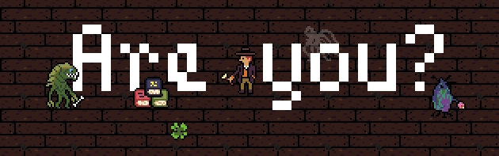

# Are you?

---

... in the attic? in the cellar? You just don't know. And what's there, in your face? And what are all those other... where? This ... what? This is not real! What are those? What are you?

You need to orient yourself. You need to find out. Things are not what they seem. You should stand still, just for a bit, before trying to move.

A game by: lupercalia & pixel-fabian

Created during [Brackeys Game Jam 2022.1](https://itch.io/jam/brackeys-7)

Build with [phaser 3](https://phaser.io/)

## Play

> Play on [itch.io](https://pixel-fabian.itch.io/are-you)

### Controls:

- move: WASD
- interact: E or Q

### Survival hints

- Don't move for now! Start slow. Be sure!
- Find the clover, u will need luck!
- Collect all 3 photos to uncover who you are.

## License

### Code

Are you? - A browser game -
Copyright (C) 2022 pixel-fabian & lupercalia

This program is free software: you can redistribute it and/or modify
it under the terms of the GNU General Public License as published by
the Free Software Foundation, either version 3 of the License, or
(at your option) any later version.

This program is distributed in the hope that it will be useful,
but WITHOUT ANY WARRANTY; without even the implied warranty of
MERCHANTABILITY or FITNESS FOR A PARTICULAR PURPOSE. See the
GNU General Public License for more details.

You should have received a copy of the GNU General Public License
along with this program. If not, see <https://www.gnu.org/licenses/>.

### Assets

- Sprites and sound effects: CC-BY-SA 4.0
- Font: BitPotion by Joeb Rogers (CC-BY)
